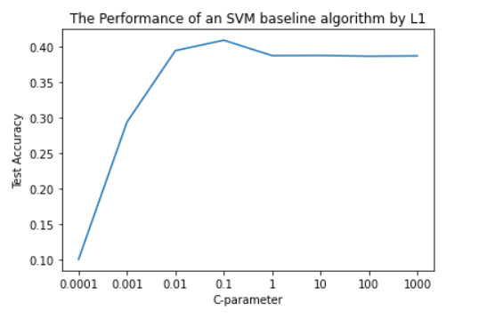

# Applying machine learning models to image classification (the Cifar10 dataset)
## Description:
- This project used the Cifar10 dataset that contains 60,000 images in 10 classes, with 6000 images per class as shown in the followed figure. This dataset was split into 50,000 images for training and 10,000 images for testing.

- This project created a simple kNN classifier on the Cifar10 dataset. This class contains a method that returns predictions for your test set and provides a suitable distance metric to calculate the nearest neighbors.
So the result was different because there are many distance metrics, as shown in the following figures:

The following table showed that Euclidean is the best distance metric.

- This project also used <strong>LogisticRegression()</strong> and executed the OvR strategy for the Cifar10 classes. The result is shown in the following figure:

- This project used Support Vector Machine (SVM) Classification with fine tuning as shown in the following figure:

### Explaining the results of these experiments and the reason for increased performance from the baseline:
After changing the C-parameter by different values as (0.0001, 0.001, 0.01, 0.1, 1, 10, 100, 1000) in an SVM baseline (LinearSVC), the accuracy test changed as (40.25%, 40.94% , 39.87%, 38.9%, 22.18%, 18.97%, 21.55%, 18.58%). When using the C parameter with the SVM, the performance changed for the best in some states or others states not. And when applying small values of C, such as 0.001, the optimization looked for a larger-margin separating hyperplane. So it gave the best result.

### The effect of the cost-paramenter and the L1 penalty on accuracy as well as any overfitting you observed.
After applying regularisation parameter (L1) with C-parameters, the test accuracy decreased by increasing the C-parameter because the strength of the regularisation is inversely proportional to C. So the results became 10.0%, 29.3%, 39.39%, 40.86%, 38.69%, 38.71%, 38.61%, 38.65% with C-parameters (0.0001, 0.001, 0.01, 0.1, 1, 10, 100, 1000).

### Explaining the confusion matrix of the best model accuracy and some reasons for high-values found off the main diagonal.
Through the confusion matrix of the best model of SVM, which determined the greatest values to true positives in each class (0 to 9) as 635, 692, 453, 407, 498, 481, 584, 599, 684, and 649 classes and made wrong the others from 1000 classes of each class (0 to 9) . For example, the class 0 had got the errors by 36.5% ((1000 - 635) / 1000). When using the champion model, the SVC by C is 100 and the gamma is 0.01. On 50,000 photos, the test's accuracy was 56.82%. The highest values were found along the major diagonal because it could predict more than 56% of the classes (0 to 9) correctly.

## Conclusion
The CIFAR-10 dataset was loaded from the Keras library (keras.datasets.cifar10). This dataset consists of 60,000 RGB images of size 32x32. The dataset was divided into 50,000 training images and 10,000 testing images. Each image was subjected to some operations like reshaping and scaling. This dataset was trained on some machine learning algorithms such as k-NN Classifier, Logistic Regression, and Support Vector Machine (SVM). The k-NN Classifier was used four distance metrics (Euclidean, Manhattan, Minkowski, and Hamming) to calculate the nearest neighbours. So the best distance measure was Euclidean by 33.85% in 50000 images. It was used to calculate the k nearest neighbours and make predictions. So the best K-parameter is 10 by 28.7% in the KNNClassifer algorithm on 10,000 images only. This sample (10000 images) was used because these iterations take a long time. A One-vs-Rest (OvR) approach was applied to Logistic Regression to achieve multi-class classification. So the accuracy test of Logistic Regression was 40.36% in 50000 images. Some different modes of the SVM were compared to determine the best performer. So the accuracy test for them (SVM baseline, SVM baseline (C = 0.001), SVM baseline (C = 0.1) by penalty ('L1'), SVC with parameters(C = 100, gamma = 0.01)) was (22.18%, 40.94%, 40.86%, 56.82%) on 50000 images. So the best model of SVM was SVC by C-parameter and Gamma-parameter as (100, 0.01) on 50000 images. After applying Feature Extraction (hog), the result (53.2%) became less than the original best model. Finally, the champion model was SVC by parameters(C = 100, gamma = 0.01) by 56.82% in test accuracy.

## References
1- https://machinelearningmastery.com/distance-measures-for-machine-learning/

2- https://towardsdatascience.com/create-your-own-k-nearest-neighbors-algorithm-in-python-eb7093fc6339

3- https://matplotlib.org/stable/gallery/axes_grid1/simple_axesgrid.html

